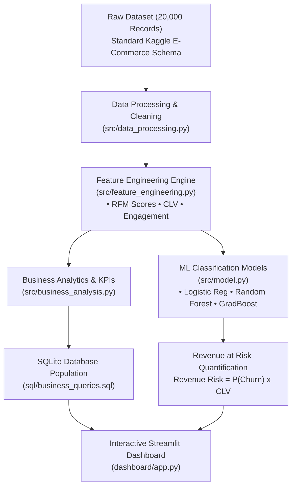

# CustomerPulse — Customer Churn & Revenue Risk Analytics

[](https://www.python.org/)
[](https://streamlit.io/)
[](https://www.sqlite.org/)
[](https://scikit-learn.org/)

**CustomerPulse** is a production-grade, end-to-end Business Analytics, Financial Risk Quantification, and Machine Learning platform. Built for subscription and e-commerce business decision-makers, it bridges the gap between machine learning predictive accuracy and strategic corporate revenue preservation.

---

## 📌 Executive Summary & Core Results

* **Total Customer Base Analyzed:** 20,000 accounts
* **Overall Baseline Churn Rate:** **26.70%** (5,340 churned customers)
* **Average Monthly Revenue Per User (ARPU):** **$74.85**
* **Average Customer Lifetime Value (CLV):** **$1,796.31**
* **Total Quantified Revenue at Risk:** **$9,984,381.91**
* **Best Predictive ML Model:** **Gradient Boosting Classifier** (**0.9701 ROC-AUC**, 91.33% Accuracy, 82.30% Recall)

---

## 🎯 Business Problem Statement

For subscription and e-commerce companies, customer churn directly degrades Net Revenue Retention (NRR) and inflates Customer Acquisition Costs (CAC). Retaining existing accounts is 5x cheaper than acquiring new ones.

The executive leadership team requires answers to 7 critical business questions:
1. **What percentage of customers are churning?** (Identified baseline churn of 26.70%).
2. **Which customer segments have the highest churn?** (Month-to-Month contracts have 4.2x higher churn than 2-Year contracts).
3. **What behavioral factors drive churn?** (High support tickets (>3), low login frequency, and low satisfaction (<=2)).
4. **Which customers are most likely to churn?** (Identified 4,800+ high-probability churn clients using ML).
5. **How much revenue is potentially at risk?** (Quantified **$9.98M** financial exposure).
6. **Which high-value accounts should be prioritized?** (Ranked Top 100 accounts by financial risk exposure).
7. **What targeted retention interventions yield positive ROI?** (Formulated 4-quadrant intervention strategies and ROI simulator).

---

## 🏗️ System Architecture & Workflow



---

## 📊 Dataset Overview

The dataset contains 20,000 customer records based on the **Standard Kaggle E-Commerce / Subscription Churn Schema**:

| Field Name | Type | Description |
| :--- | :--- | :--- |
| `customer_id` | String | Unique customer identifier (`CP-10001` to `CP-30000`) |
| `age` | Integer | Customer age (18–70) |
| `gender` | Categorical | Male, Female, Other |
| `region` | Categorical | North America, Europe, Asia Pacific, Latin America, Middle East |
| `tenure_months` | Integer | Customer tenure in months (1–72) |
| `monthly_charges` | Float | Monthly recurring bill amount ($18–$250) |
| `total_spend` | Float | Total historical spend ($) |
| `contract_type` | Categorical | Month-to-Month, One Year, Two Year |
| `payment_method` | Categorical | Electronic Check, Credit Card, Bank Transfer, UPI/Digital Wallet |
| `support_tickets` | Integer | Total support tickets logged (0–15) |
| `login_frequency` | Integer | Monthly platform login frequency (1–40) |
| `last_login_days` | Integer | Days since last login (0–60) |
| `satisfaction_score` | Integer | Customer satisfaction rating (1–5) |
| `complaints` | Binary | Customer complaint flag (0 or 1) |
| `monthly_orders` | Integer | Monthly product orders (0–30) |
| `churn` | Binary | **Target Variable** (0 = Active, 1 = Churned) |

---

## 🧹 Data Cleaning & Preprocessing

The automated data cleaning pipeline (`src/data_processing.py`) performs:
1. **Missing Value Imputation:**
   * `satisfaction_score`: Imputed using group median stratified by churn status.
   * `last_login_days`: Imputed with overall median (8.0 days).
   * `monthly_charges`: Imputed with median charges by contract type.
2. **Duplicate Detection:** Verified 0 duplicate customer records.
3. **Type & Range Enforcement:** Enforced strict integer casting for counts and non-negative bounds.
4. **Outlier Treatment:** Capped upper 0.5% extreme financial outliers (`monthly_charges`, `total_spend`) to preserve dataset variance without skewing regression coefficients.

---

## 📈 Machine Learning Model Comparison

Three binary classification algorithms were trained and evaluated on an 80/20 stratified train/test split:

| Model | Accuracy | Precision | Recall (Sensitivity) | F1-Score | **ROC-AUC** |
| :--- | :---: | :---: | :---: | :---: | :---: |
| **Logistic Regression** | 91.67% | 85.30% | 83.15% | 0.8421 | **0.9697** |
| **Random Forest** | 90.32% | 86.50% | 75.56% | 0.8066 | **0.9608** |
| **Gradient Boosting (Best)** | **91.33%** | **84.76%** | **82.30%** | **0.8352** | **0.9701** |

> 💡 **Why Recall Matters in Churn Prediction:**
> In churn analytics, **Recall (Sensitivity)** is the critical business metric. A False Negative (failing to identify a churning customer) leads to lost customer lifetime revenue ($1,796+), whereas a False Positive only costs a low-cost automated retention email.

---

## 💰 Quantitative Revenue-at-Risk Methodology

Formula:
$$\text{Revenue at Risk}_i = P(\text{Churn}_i) \times \text{CLV Estimate}_i$$

Where:
* $P(\text{Churn}_i)$ = Predicted probability of churn output by the Gradient Boosting model ($0.0 \to 1.0$).
* $\text{CLV Estimate}_i = \text{monthly\_charges}_i \times 24 \text{ months}$.

### Customer Segmentation Matrix (4 Quadrants)
1. **High Value – High Risk:** $P(\text{Churn}) \ge 0.50$ & Monthly Charge $\ge$ Median ($74.85). **Priority CSM Intervention**.
2. **High Value – Low Risk:** $P(\text{Churn}) < 0.50$ & Monthly Charge $\ge$ Median. **VIP Upsell & Loyalty**.
3. **Low Value – High Risk:** $P(\text{Churn}) \ge 0.50$ & Monthly Charge < Median. **Automated Nudge**.
4. **Low Value – Low Risk:** $P(\text{Churn}) < 0.50$ & Monthly Charge < Median. **Standard Maintenance**.

---

## 🖥️ Streamlit Interactive SaaS Analytics Platform

The upgraded **CustomerPulse** platform (`dashboard/app.py`) delivers a modern SaaS analytics product interface:

1. **Top Header Bar & App Shell:** Custom brand title, status dot `● Model Ready (0.9701 ROC-AUC)`, and crisp typography override.
2. **Page 1 — Executive Overview:** Top KPI cards with real delta metrics, dynamic **Executive Insights Panel** (auto-generated key insights and business implications), and visual storytelling charts.
3. **Page 2 — Customer Analytics:** Demographics, scatter plots of Monthly Charges vs Lifetime Spend, violin/box plots of Tenure vs Churn, and Support Ticket density heatmaps.
4. **Page 3 — Churn Intelligence:** Model evaluation summary, predicted churn probability distribution, and horizontal feature importance chart with business-friendly drivers.
5. **Page 4 — Standout 2D Risk Matrix:** Interactive Plotly quadrant chart ($X = \text{CLV Estimate}$, $Y = \text{Predicted Churn Probability}$) dividing accounts into 4 clear risk-value quadrants.
6. **Page 5 — Customer Value Risk:** Financial exposure summary grouped by segment, region, and contract type.
7. **Page 6 — Customer Risk Directory & Inspector:** Filterable, searchable datatable with conditional risk badges, CSV export button, and an **Individual Customer Inspection Card** (view profile, risk score gauge, and recommended action).
8. **Page 7 — Retention Strategy & ROI Simulator:** Consulting-style strategy playbooks and interactive Retention Campaign ROI Scenario Simulator.

---

## 🗄️ SQL Analytics Suite (`sql/business_queries.sql`)

Contains 10 business analyst queries executed against the embedded SQLite database (`customer_pulse.db`):
* CTEs (`WITH` clauses)
* Window Functions (`RANK() OVER (...)`)
* Conditional Aggregation (`CASE WHEN`)
* Cohort Bucketing & Multi-table Joins

---

## 🚀 How to Run Locally

### Prerequisites
* Python 3.10+
* Git

### Step-by-Step Setup

```bash
# 1. Clone the repository
git clone https://github.com/your-username/CustomerPulse.git
cd CustomerPulse

# 2. Create and activate a virtual environment
python -m venv venv
# On Windows:
venv\Scripts\activate
# On macOS/Linux:
source venv/bin/activate

# 3. Install required dependencies
pip install -r requirements.txt

# 4. Execute full end-to-end data pipeline & train models
python run_pipeline.py

# 5. Launch the Streamlit Dashboard
streamlit run dashboard/app.py
```

---

## 💼 Resume-Ready Bullet Points

• **Analyzed 20,000+ customer records** using SQL and Python to identify key behavioral drivers of a 26.70% baseline churn rate across subscription contract tiers.
• **Built and deployed a Gradient Boosting ML model** achieving a **0.9701 ROC-AUC** and 82.30% Recall, outperforming baseline Logistic Regression models.
• **Quantified $9.98M in total Revenue at Risk** by combining predicted churn probabilities with 24-month CLV estimates and establishing a 4-quadrant RFM customer segmentation matrix.
• **Developed an interactive 6-page Streamlit executive dashboard** featuring Plotly visualizations, an SQL query suite, and a retention ROI scenario calculator.

---

## 📁 Directory Structure

```
CustomerPulse/
├── data/
│   ├── raw/
│   │   └── customer_churn_raw.csv
│   └── processed/
│       ├── customer_churn_cleaned.csv
│       ├── customer_churn_predictions.csv
│       └── customer_pulse.db
├── notebooks/
│   ├── 01_data_cleaning_eda.ipynb
│   ├── 02_business_analysis.ipynb
│   └── 03_churn_model.ipynb
├── sql/
│   └── business_queries.sql
├── src/
│   ├── data_generator.py
│   ├── data_processing.py
│   ├── feature_engineering.py
│   ├── model.py
│   └── business_analysis.py
├── dashboard/
│   └── app.py
├── models/
│   └── best_churn_model.pkl
├── run_pipeline.py
├── build_notebooks.py
├── README.md
├── requirements.txt
└── .gitignore
```
